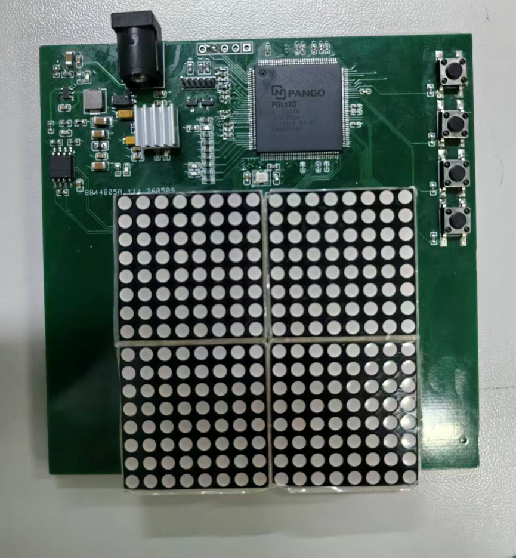
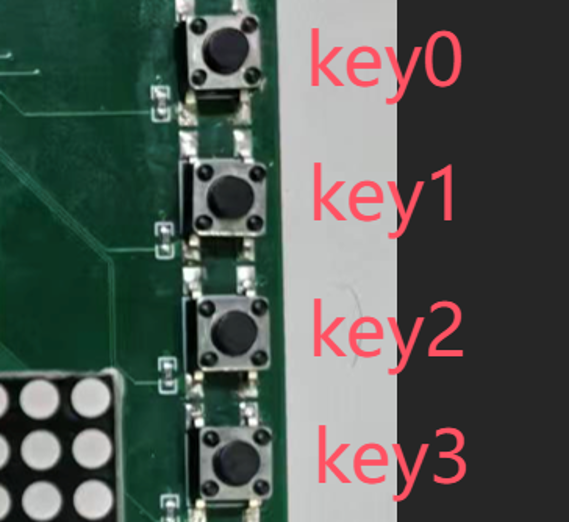

# 16x16 矩阵屏动态显示系统 - 用户操作手册

## 系统概述

| 组件 | 规格 |
|------|------|
| **核心主控** | 紫光同创 PGL12G-6ILPG144 |
| **输出设备** | 4块 8×8 LED点阵屏（拼接为 16×16 分辨率） |
| **输入设备** | 4个独立轻触按键（Key 0 ~ Key 3） |
| **硬件定时** | 100MHz精准定时 |

---

## 🎮 按键功能速查表

| 按键 | 功能 | 操作说明 |
|------|------|---------|
| **Key 0** | 🏠 恢复默认（复位） | 任何状态下按下此键，屏幕立刻停止动画，恢复为静态字母 "F" 显示 |
| **Key 1** | ⭕ 圆形模式 | 按下此键，屏幕切换为静态圆形图案。此时按 Key 3 可开启画圆动画 |
| **Key 2** | ➔ 箭头模式 & 转向 | 按下此键，屏幕切换为静态箭头图案。连续点按此键，箭头会在 8 个方向中循环切换 |
| **Key 3** | ▶️ 播放/切换动画 | 在圆形或箭头模式下循环切换：第1下开启正向、第2下逆向、第3下停止 |

---

## 📺 三大模式详解

### 1️⃣ 字母模式（Shape Mode 0）

- **触发方式**：按 Key 0 或系统刚上电时
- **显示效果**：屏幕中央显示完美对齐的静态大写字母 "F"
- **动画**：无

### 2️⃣ 圆形模式（Shape Mode 1）

- **触发方式**：按 Key 1
- **显示效果**：屏幕显示静态圆形
- **动画效果**（按 Key 3 触发）：
  - **正向动画**：耗时 2 秒，从正上方开始，光点顺时针逐个点亮，直至画满全圆
  - **逆向动画**：耗时 2 秒，光点逆时针逐个点亮

### 3️⃣ 箭头模式（Shape Mode 2）

- **触发方式**：按 Key 2
- **方向控制**：连续按 Key 2，箭头依次指向：上 → 右上 → 右 → 右下 → 下 → 左下 → 左 → 左上
- **动画效果**（按 Key 3 触发）：
  - **正向动画**：耗时 3 秒，箭头从尾部向尖端方向浮现，如同雷达扫描
  - **逆向动画**：耗时 3 秒，动画轨迹完全反转

---

## ⚠️ 硬件使用安全须知（必读）

为了保证紫光 PGL12G 芯片与点阵屏的长期稳定运行，请严格遵守以下物理规范：

### 1. 禁止单靠 USB 供电

- 16×16 屏幕全亮时瞬间功耗极大
- **必须使用**外部 DC 电源适配器（5V / 2A 及以上）给开发板供电

### 2. 防热关断保护

- 若长时间开启高亮度的静态图形，开发板电源芯片可能因发热触发"热保护"导致自动息屏
- **出现自动息屏时**：
  1. 断电冷却 1 分钟
  2. 再次开机
  3. ⚠️ 切勿在发烫时反复硬重启

---

## 📋 快速参考

- **完整周期控制**：Key 0 重置 → Key 1/2 选择模式 → Key 2 调整方向（仅箭头模式）→ Key 3 切换动画
- **所有动画循环播放**，直到按下其他按键
- **精准定时**：所有动画都基于 100MHz 硬件定时实现

---

*最后更新：2026-06-21*
